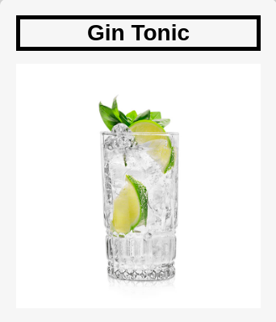

# DrinkApp

The following project is divided into 3 parts.

- [Tab1](#tab1)

- [Tab2](#tab2)

- [Tab3](#tab3)

## Tab1

Inside the first section it is possible to search in the search bar the drink of our interest, then the specifications of the selected drink will be shown.

 

 

 

  - **Important**

to carry out searches the language supported at the moment is only English

 

After doing our research we will be sent to the research section. 

  

 

## Tab2

 

  

Within the second tab we can see all the specifications of the drink we searched for earlier. Within the second tab we can see all the specifications of the drink we searched for earlier. 

 

  

In addition, through the buttons it is possible to add the drink of our interest to the reservation. 
For this section it is advisable to implement a back-end for reservations.

  

 

## Tab3

  

In the 3 section it will be possible to see the bookings made, in this moment I have not implemented the back-end for the bookings so the cocktail list will be momentarily empty

  

# Because Alcohol Comes First

*Enjoy 2F*

